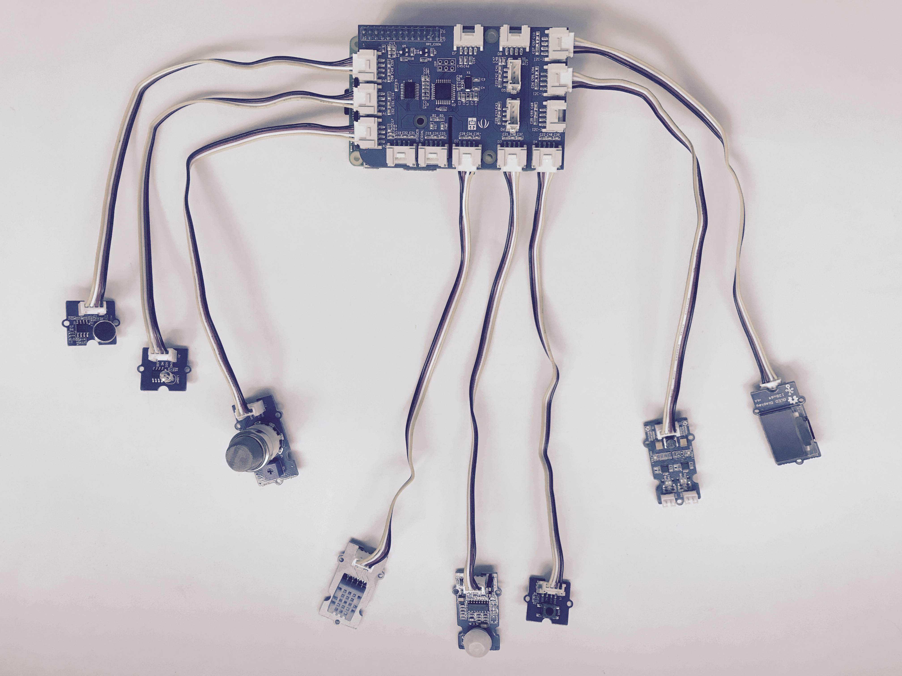

# Overview
The full name of hecMeter is high end configure Meter. This kind of meter have full function of meter that could help customer finish their work with high efficiency.
We make serveral classic usage using our meter. It is working fine with our test.

# GetStarted
## Setup your hecMeter
### Prepare the necessary working condition for meter
1. In order to run the meter graful, A good power adapter is needed. Any DC24v
   power supply would be fine but note that the current of power supply should
   be more than 1A.
2. Plus in the sensor connecter. Make sure the sensor you hold is suport by our
   meter.  
3. Put SD Card into Meter.
4. Plus in the power connecter, then long press power key. The meter should run
   up and show the value base on sensor type.  
5. Optional, install dp_tool.exe on PC and connect the meter using usb connector.

### Setup Azure IOTHUB Devices Connect String on TPM
1. Open browser, login win10 iot core web console "http://ip-address:8080", Account: Administrator, Password: (You enter on IOT Core Dashboard)
1. Move on "TPM configuration"
2. Intall "Software TPM Emulator(NoSecurity)", wating system restart.
3. Copy "Connection string—primary key"(Refer to [Create Azure IOTHUB](https://github.com/Seeed-Studio/AzureGroveKit#create-azure-iothub)) on "TPM configuration --> Logical devices settings --> Logical device ID: 0 --> Azure Connection String", Then save.

### Deploy AzureGroveKit UWP App
The app help to connect Azure iothub, collect Grove sensor value and control Grove output.
1. Wating Win10 IoT setup, Setting Wi-Fi, Remember the IP Address
2. Open browser, login win10 iot core web console "http://ip-address:8080"
3. Move on "Apps --> Install app"
4. "App package" choice "UWP/Release/AzureGroveKit_[version]_Debug_Test/AzureGroveKit_[version]_arm_Debug.appxbundle"
5. "Certificate" choice "UWP/Release/AzureGroveKit_[version]_Debug_Test/AzureGroveKit_[version]_arm_Debug.cer"
6. "Dependency" choice one "UWP/Release/AzureGroveKit_[version]_Debug_Test/Dependencies/ARM", the click "Add dependency" to choice nexe.
5. "Deploy" click "GO", waiting a few minutes
6. Refresh, you can find AzureGroveKit on Apps row

### Test meter using dp_tool.exe on PC
1. Power off raspberry, Insert GrovePi module.
2. Insert necessary Grove on GrovePi, Connect map below:

  Grove| GrovePi Port
  -----| ------------
  D2   | Grove - Temp&Humi Sensor
  D3   | Grove - PIR Motion Sensor
  D4   | Grove – Button
  D5   | Grove - Relay
  A0   | Grove - Sound Sensor
  A1   | Grove - Light Sensor
  A2   | Grove - Gas Sensor
  I2C1 | Grove - OLED Display 0.96"
  I2C2 | Grove - Mini I2C Motor Driver
3. Power on and login web console "http://ip-address:8080"
4. Move on "App Manager --> Apps", Run "AzureGroveKit"
5. The app will display on output, Click "Run", Now The App send message to IOTHUB, and can response command.
6. Check "YOUR IOTHUB --> Overview --> Usage", i will show the message count.
7. If you use windows, use [DeviceExplorer](https://github.com/Azure/azure-iot-sdk-csharp/tree/master/tools/DeviceExplorer) see more info.
8. More UWP overview, refer to https://github.com/Seeed-Studio/AzureGroveKit/tree/master/UWP

## Create Azure IOTHUB
1. Login "https://portal.azure.com/", if you havn't account, first signup.
2. Create "New --> Internet of Things --> IoT hub", detail refer to https://docs.microsoft.com/en-us/azure/iot-hub/iot-hub-create-through-portal
3. create a device, move on "All resources --> YOUR_IOTHUB --> Device Explorer --> Add Device", save
4. click the device, copy "Connection string—primary key"
