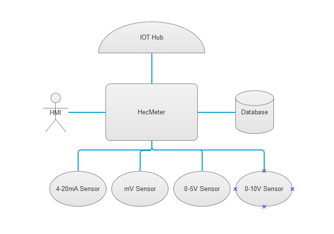
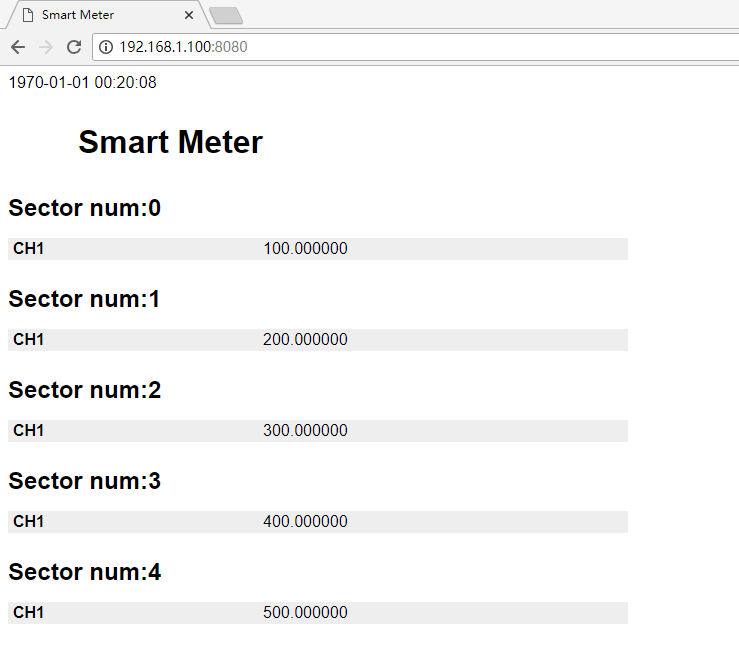
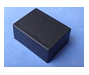

# Overview
The full name of hecMeter is high end configure Meter. This kind of meter have full function of meter that could help customer finish their work with high efficiency.
We make serveral classic usage using our meter. It is working fine with our test.

# GetStarted
## Setup your hecMeter
### Prepare the necessary working condition for meter
1. In order to run the meter graful, A good power adapter is needed. Any DC24v
   power supply would be fine but note that the current of power supply should
   be more than 1A.
2. Plus in the sensor connecter. Make sure the sensor you hold is suport by our
   meter.  
3. Put SD Card into Meter.
4. Plus in the power connecter, then long press power key. The meter should run
   up and show the value base on sensor type.  
5. Optional, install dp_tool.exe on PC and connect the meter using usb connector.

### Setup Azure IOTHUB Devices Connect String on TPM
1. Open browser, login win10 iot core web console "http://ip-address:8080", Account: Administrator, Password: (You enter on IOT Core Dashboard)

### Deploy AzureGroveKit UWP App
The app help to connect Azure iothub, collect Grove sensor value and control Grove output.
1. Wating Win10 IoT setup, Setting Wi-Fi, Remember the IP Address

### Test meter using dp_tool.exe on PC
1. Power off meter, Insert power/sensor connector.
2. Note that the terminal has the meanning of bellow:

  Grove| Name of Port
  -----| ------------
  V+   | Sensor power supply
  S+   | Sensor positive signal
  S-   | Sensor negative signal
  GND  | Sendsor power ground
  A+   | RS485 A+
  A-   | RS485 A-
  DP   | USB D+
  DN   | USB D-
  SH   | Connect to earth ground
3. Power on meter by press power key, and then PLUS the usb on.
4. Open dp_tool.exe to connect to meter

#### Detail of the meter
#####  Power manage: use
外形尺寸：33.5mm 25.5mm 14.7mm

内部尺寸：31.2mm 23.2mm 12.6mm

材料：聚碳，带阻燃

耐温：200+度，高温，耐性好，不容易变形

##### input.
##### communicate:
  1.RS485.
  2.USB

### Status of development
  Module Name   | satus
  --------------| ---------
  web server    | OK(verify)
  usb touch     | OK(verify)
  lvgl display  | OK(verify)
  mtp server    | portting finish,need verify
  sqlite support| portting finish,need verify
  .xls  support | portting finish,need verify
  mp3401 sensor | need more code to be write
 